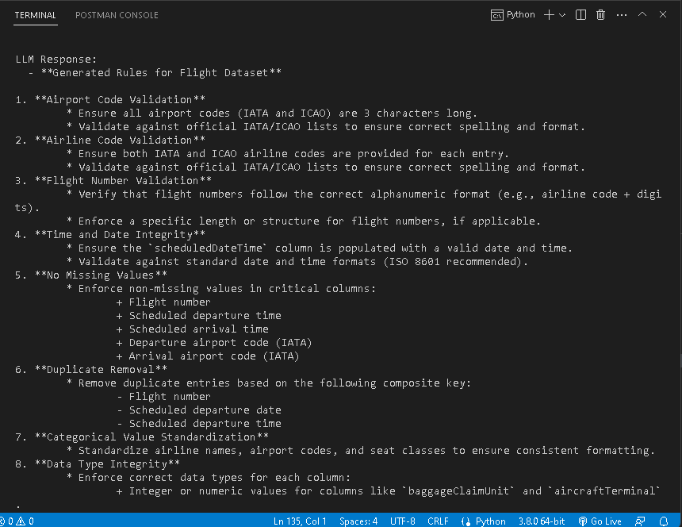

# RAG with Llama 3.1: A Simple Starter Code

This repository provides a **basic example** of using **Retrieval-Augmented Generation (RAG)** with the **Llama 3.1 (8B)** model. The purpose is to demonstrate how RAG can enhance a language model's responses by providing external context from a knowledge base, reducing hallucinations and improving the relevance of generated content.

The code is designed for simplicity and serves as a starting point for understanding and implementing RAG concepts.

## Overview

RAG enables language models to retrieve relevant knowledge from external sources, making them more accurate and context-aware. In this example:

1. A set of aviation data standards is embedded and stored in **Elasticsearch**.
2. When a prompt is given, **RAG** retrieves the most relevant content using a similarity search.
3. The retrieved content is passed along with the prompt to **Llama 3.1**, ensuring that the generated responses are informed by external data.

This approach is particularly useful for domains like aviation, where accuracy and adherence to standards are critical.




## How It Works

1. **Embedding and Storage**:
   - Aviation dataset standards are converted into dense vector embeddings using `all-MiniLM-L6-v2`.
   - These embeddings and their associated content are stored in **Elasticsearch**.

2. **Retrieval and Augmentation**:
   - A query (or dataset) is provided as input.
   - **Elasticsearch** retrieves the most relevant documents based on cosine similarity.
   - The retrieved documents are combined with the input query to form a context-rich prompt for Llama.

3. **Generation**:
   - The augmented prompt is passed to **Llama 3.1**, which generates customized rules or responses based on the provided context.

## Getting Started

### Prerequisites

* **Python 3.8+**
* **Docker** (to run Elasticsearch)
* **Llama 3.1 (8B)** model setup (via Ollama or similar)
* Install required libraries:

  ```bash
  pip install numpy sentence-transformers elasticsearch

# Steps to Run
1. **Set Up Elasticsearch**
   
Run Elasticsearch locally using Docker:

```bash
docker run -d --name elasticsearch -p 9200:9200 -e "discovery.type=single-node" elasticsearch:7.17.0
```
Ensure Elasticsearch is running on `http://localhost:9200`
  
2. **Populate Elasticsearch with Sample Data**
   
Use the script store_to_elasticsearch.py to store aviation standards in Elasticsearch:

```bash
python store_to_elasticsearch.py
```
This script:

* Converts aviation standards into embeddings using `all-MiniLM-L6-v2`.
* Stores the embeddings and associated content in Elasticsearch.

3. **Run the RAG Application**
   
Use the script run_rag_application.py to retrieve relevant content and generate rules with Llama:

```bash
python RAG_LLM.py
```
* Input: Provide a CSV file named `rag_and_llm.csv` containing your query or dataset.
* Output: Retrieved context from Elasticsearch and generated rules or responses from Llama 3.1.

# Notes

* This is starter code for understanding the basics of RAG. It can be extended or customized for specific use cases.
* Instead of using local Elasticsearch, you can integrate with cloud APIs like OpenSearch or Elastic Cloud.
* The Llama 3.1 model can be replaced with other language models if needed.
* Prompts and retrieved contexts can be tailored to your specific domain.

# Disclaimer


This code is provided as a simple example to get started with RAG. The aviation dataset standards used here are samples and should not be treated as comprehensive or authoritative. Always validate generated results for accuracy and compliance with real-world standards.
